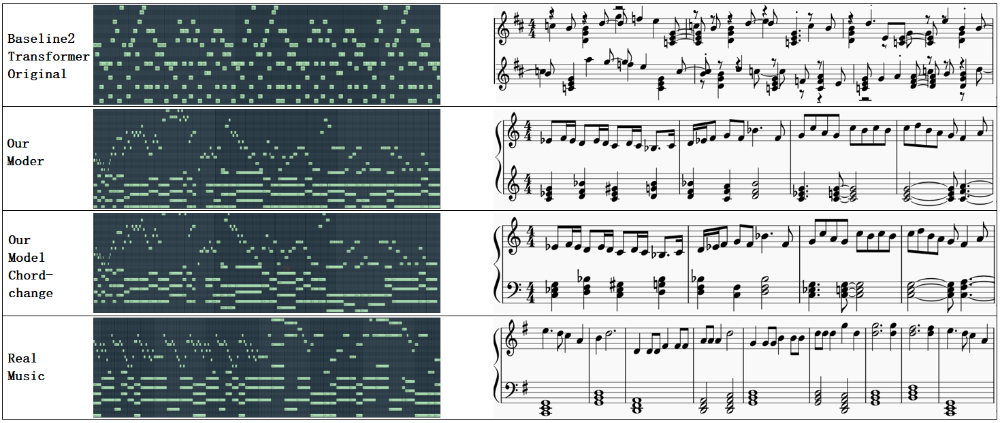

# MCSF-MD: Research on automatic composition of separation and refusion based on Transformer
Code for the paper *

### Main musci generate flow chart
<p align="center">
  
</p>
### Chords statistics
<p align="center">
  
</p>
### Genreat results
<p align="center">
  
</p>

### Setup the environment

We work with a conda environment.
python >= 3.6   music21

### Total
  midi_files:311,
  chords_all:12879,
  chords_type:53,
  notes_all:54001,
  notes_type:1015,

### Data Download

- Install [Music21](https://pypi.org/project/music163/). Ensure, you can pip install music21 ```music21``` and you can learn from [Music21 tools](http://web.mit.edu/music21/).    
- Option 1: Download [LYH-checkpoint](https://drive.google.com/drive/folders/1T8dGldM-U6LSBot1aZesZ3beFg_veSwG) and place the home folder.     
- Option 2: Train the checkpoint model by youself. See Running the code.

### Running the code

1. Set ```is_training``` in ```main.py``` is True
2. ```python main.py ```


### Generating the music

1. Set ```is_training``` in ```main.py``` is False
2. ```python main.py ```


### Others

If you just want to enjoy the generated music, you can check out the folder ```result_midi```.

### Citation

If this paper is useful for your research, please cite us at:

### Contact

For any questions, please email at (512796310@qq.com)

